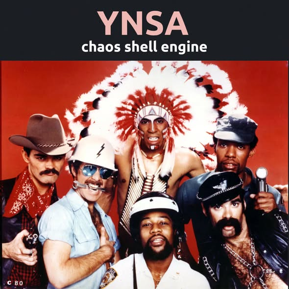

## Working in progress

Working in progress and other stuff that I prefer to share here to give them a chance someone notice.

### Index

* **Chaos Shell Engine**: 1. [presentation](chaos-shell-engine.md), &nbsp; 2. [lab notes](random.txt) &nbsp; from which the presentation has been made.

Because exceptions, do not need to be common but just exist:

* [Novelties and Possibly mistakes](https://chatgpt.com/share/69886a46-5d0c-8012-a863-0094dca59e83), but why do not investigate a bit deeper? Outside where AIs cannot go.
* New Proofs for NMAC and HMAC: [Security without Collision-Resistance](https://eprint.iacr.org/2006/043.pdf) by Mihir Bellare, April 2024.

And sometime, an image is worth thousands of words...

---

---

### Copyright

- (c) 2026, Roberto A. Foglietta <roberto.foglietta@gmail.com>, CC ND-BY-NC 4.0
