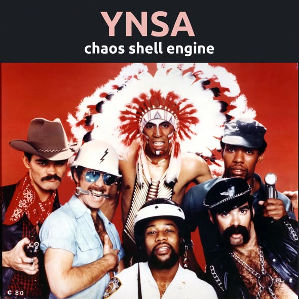

## Working in progress

Working in progress and other stuff that I prefer to share here to give them a chance someone notice.

### Index

* **Chaos Shell Engine**: 1. [presentation](chaos-shell-engine.md), &nbsp; 2. [lab notes](random.txt) &nbsp; 3. [thesys on jitters](2007-07-30-Tesi_Foglietta-051a.pdf)
* **Micro Chaos Engine**: 1. [presentation](uchaos-vs-jitterentropy.md), &nbsp; 2. [uchaos.c](prpr/uchaos.c), 3. [vs jitterentropy](uchaos-vs-jitterentropy-grok.txt) w/Grok
* **uChaos vs kernel**: 1. [presentation](uchaos-vs-kernel-ring.md), &nbsp; 2. [datalogs](https://github.com/robang74/working-in-progress/raw/refs/heads/main/data/uchaos-256GB-test.log.gz) of PractRnd 256GB test passed
* **uChaos vs 0°K VMs**: 1. [presentation](uchaos-vs-zero-kelvin-qemu.md), &nbsp; 2. a QEMU peculiar configuration `QZERO=1` by [start.sh](https://github.com/robang74/bare-minimal-linux-system/releases/tag/bmls-v0.2.3)
* **uChaos vs Thermodynamics**: 1. [presentation](uchaos-vs-thermodynamics.md), &nbsp; 2. release [uchaos-v0.3.2](https://github.com/robang74/working-in-progress/releases/tag/uchaos-v0.3.2) as reference for uChaos testing
* **uChaos static x86 64** available: 1. [prpr/bin](prpr/bin) folder, &nbsp; 2. self-extracting executable by [gzcmd.sh](https://github.com/robang74/bare-minimal-linux-system/blob/main/gzcmd.sh)
* **uChaos testing in 0°K VM** in: 1. [blms-v0.2.6](https://github.com/robang74/bare-minimal-linux-system/releases/tag/bmls-v0.2.6), &nbsp; 2. run `sh start.sh -Z` or `-z` for manual.
* **uChaos supports i686 32bit** in: 1. [uchaos-v0.5.6](https://github.com/robang74/working-in-progress/releases/tag/uchaos-v0.5.6), &nbsp; 2. reference to [blms-v0.2.7](https://github.com/robang74/bare-minimal-linux-system/releases/tag/bmls-v0.2.7) for VM tests.
* **uChaos Linux Kernel driver** in: 1. release [uckdev-v0.5.7](https://github.com/robang74/working-in-progress/releases/tag/uckdev-0.5.7), &nbsp; 2. system test [blms-v0.3.1](https://github.com/robang74/bare-minimal-linux-system/releases/tag/bmls-v0.3.1), &nbsp; 3. [presentation](kdev/uchaos-kdev-vs-chacha20-et-al.md).

Because exceptions, do not need to be common but just exist. In particular, about Chaos Shell Engine:

* [Novelties and Possibly mistakes](https://chatgpt.com/share/69886a46-5d0c-8012-a863-0094dca59e83) or [here](chaos-shell-engine-02.txt), but why do not investigate a bit deeper? Outside where AIs cannot go.
* New Proofs for NMAC and HMAC: [Security without Collision-Resistance](https://eprint.iacr.org/2006/043.pdf) or [here](pdf/security-without-collision-resistance-2006-043.pdf) by Mihir Bellare, April 2014.

The results are quick to summarise and they relate to every barrier overcome:

* [uchaos](prpr/uchaos.c) achievements: **VMs**: ok; **32bit**: ok; **IoT**: 2MB RAM, 3MB system; **Energy**: 2W TDP; **Speed**: 300 h64/s;
* hardest test passed: **PractRand** stdin64 on over 256GB data generated by a single proc/thread w/ fixed input and no reseeding;
* support **TSC** which is availabe on x86 arch only, but it works the same with **portable** `clock_gettime()`;
* it runs w/ a single proc/thread using djb2 customised hash + a single line 2 ops whitening finalizer.

And sometime, an image is worth thousands of words...

---

- **metadata** of the image: [YNSA.jpg.txt](img/YNSA.jpg.txt) which contains a stenographic secret
- **sha256sum** of the image: 12390eb1db675f4308c2ac3af1442c730ff5904e

---

### Copyright

- (c) 2026, Roberto A. Foglietta <roberto.foglietta@gmail.com>, CC ND-BY-NC 4.0
